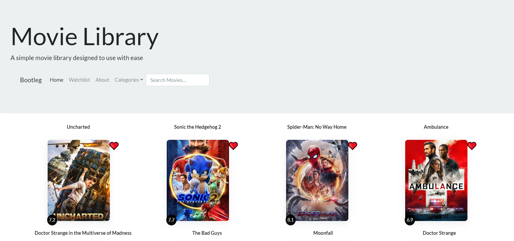

# Project1

# Description
A movie query library that displays information based on popularity, categeory, and user input. Users are able to save their interests to our watchlist, for their convenience.

# Site Preview

    

# Github Links
- Repository: https://github.com/brianalegre/Project1
- Deployed: https://brianalegre.github.io/Project1/

# Technologies Used
- OMDB API
- IMDB API
- TMDB API
- Bootswatch
- JQuery

# Criteria
- Use a CSS Framework
- Deplayed to Github
- Accept\Respond to user input
- At least one Server Side API
- No Alerts, Confirms or prompts
- Use local.storage, IF applicable
- Responsive - Media Queries
- Polished UI
- Good file structure, and naming conventions
 - Semantic naming conventions
 - Good identation
 - Quality comments
- REAME to have:
 - Unique name
 - Description
 - Technologies used
 - Screenshot
 - Link to deployed application